<!-- README.md is generated from README.Rmd. Please edit that file -->

# ggpointless 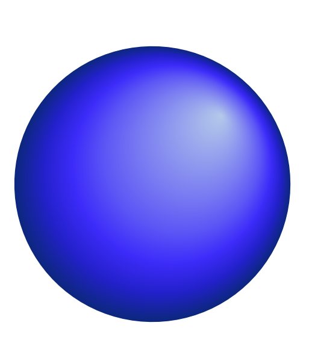

<!-- badges: start -->

[](https://CRAN.R-project.org/package=ggpointless)
[](https://github.com/flrd/ggpointless/actions/workflows/R-CMD-check.yaml)

[](https://app.codecov.io/gh/flrd/ggpointless)
<!-- badges: end -->

ggpointless is an extension of the
[`ggplot2`](https://ggplot2.tidyverse.org/) package providing additional
layers.

## Installation

You can install ggpointless from CRAN with:

``` r
install.packages("ggpointless")
```

Or install development version from Github with

``` r
# install.packages("pak")
pak::pkg_install("flrd/ggpointless")
```

## What will you get

The package groups into two categories:

**Visual effects** — purely aesthetic layers that change how data looks
without transforming it:

- `geom_area_fade()` – area plots with a gradient fill
- `geom_point_glow()` – adds a radial gradient glow to point plots

**Data transformations** — geoms backed by a stat that fits or
transforms data:

- `geom_arch()` & `stat_arch()` – draws a catenary arch
- `geom_catenary()` & `stat_catenary()` – draws a catenary curve
- `geom_chaikin()` & `stat_chaikin()` – smooths paths using Chaikin’s
  corner cutting algorithm
- `geom_fourier()` & `stat_fourier()` – fits a Fourier series to `x`/`y`
  observations and renders the reconstructed curve
- `geom_lexis()` & `stat_lexis()` – draws a Lexis diagram
- `geom_pointless()` & `stat_pointless()` – emphasises selected
  observations with points

See
[`vignette("ggpointless")`](https://flrd.github.io/ggpointless/articles/ggpointless.html)
for details and examples.

### Theme setup

``` r
library(ggpointless)
#> Loading required package: ggplot2

# set consistent theme for all plots
cols <- c("#311dfc", "#a84dbd", "#d77e7b", "#f4ae1b")
theme_set(
  theme_minimal() + 
    theme(geom = element_geom(fill = cols[1])) +
    theme(palette.fill.discrete = c(cols[1], cols[3])) +
    theme(palette.colour.discrete = cols)
  )
```

## geom_arch

`geom_arch()` draws a catenary arch (inverted catenary curve) between
successive points. Hence it’s mirroring `geom_catenary()`.

``` r
df_arch <- data.frame(x = seq_len(4), y = c(1, 1, 0, 2))
p <- ggplot(df_arch, aes(x, y)) +
    geom_point(size = 3) +
  ylim(0, 3.5)

p + geom_arch()
```

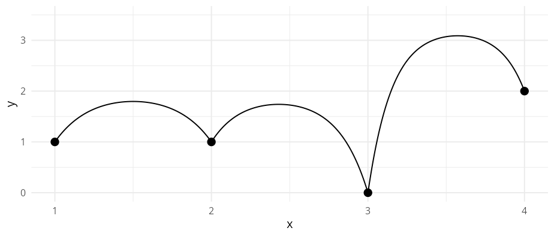

By default the arch length is twice the Euclidean distance. You can
change that for each segment using the arguments `arch_length` or
`arch_height` (vertical rise above the *highest* endpoint of each
segment).

``` r
df_arch <- data.frame(x = seq_len(4), y = c(1, 1, 0, 2))
ggplot(df_arch, aes(x, y)) +
  geom_arch(
    arch_height = c(1.5, NA, 0.5),
    arch_length = c(NA, 6, NA)
    ) +
  geom_point(size = 3) +
  ylim(0, 3.5)
```

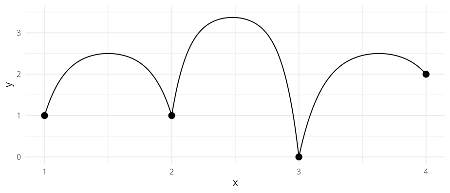

## geom_area_fade

`geom_area_fade()` behaves like
[`geom_area()`](https://ggplot2.tidyverse.org/reference/geom_ribbon.html)
but fills each area with a vertical [linear
gradient](https://search.r-project.org/R/refmans/grid/html/patterns.html).

``` r
set.seed(42)
df_fade <- data.frame(
  x = seq_len(60),
  y = cumsum(rnorm(60, sd = 0.35))
)

p <- ggplot(df_fade, aes(x, y))
p + geom_area_fade()
```

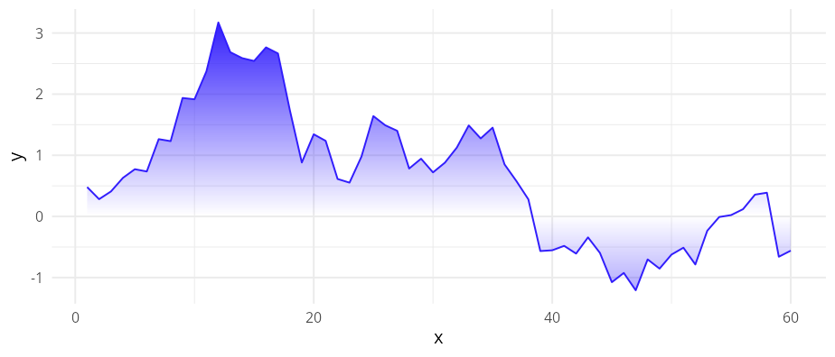
By default, the gradient fully transparent at at `y = 0` (the baseline)
and proportionally opaque at the data values. That is, opacity scales
with absolute distance from zero, so e.g. `y = -1` and `y = +1` always
receive the same alpha.

You can control the alpha value the fill fades to using the
`alpha_fade_to` argument. By that logic you can effectively reverse the
direction of the gradient. The outline colour is unaffected from the
alpha logic.

``` r
p + geom_area_fade(alpha = 0, alpha_fade_to = 1)
```

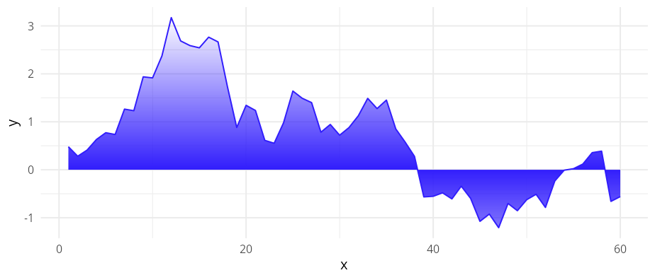

`geom_area_fade()` supports the `orientation` argument familiar from
other `geom_*` functions. With `orientation = "y"`, you create a
horizontal area chart where the gradient fades from `x = 0` toward the
data values.

``` r
p + geom_area_fade(
  aes(y, x),
  orientation = "y",
  colour = "#333333" # changes outline colour
  )
```

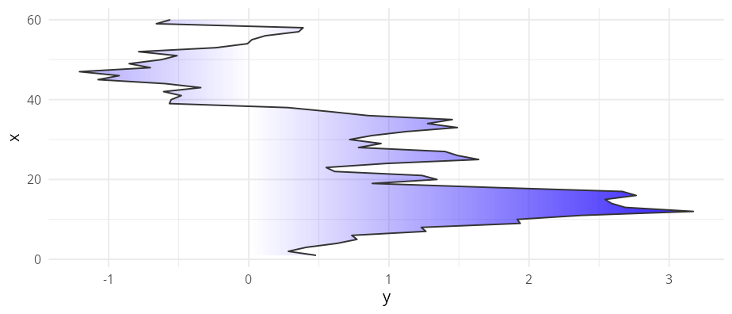

### 2D gradient

Since [ggplot2 version
4.0.0](https://tidyverse.org/blog/2025/09/ggplot2-4-0-0/#area-and-ribbons)
was released both `geom_area()` and `geom_ribbon()` allow a varying
`fill` aesthetic within a group. `geom_area_fade()` creates a
2D-gradient in such cases which combines the vertical and horizontal
gradients.

``` r
p + geom_area_fade(aes(fill = y), colour = cols[1]) +
  scale_fill_continuous(palette = scales::colour_ramp(cols))
```

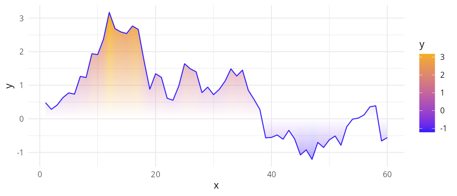

> **Note** – Not all graphic devices support this kind of gradient, see
> [`vignette("ggpointless")`](https://flrd.github.io/ggpointless/articles/ggpointless.html)
> for more details and examples.

### Multiple groups

When your data contains multiple groups those are stacked
(`position = "stack"`) and aligned (`stat = "align"`) – just like
`geom_area()` does it. By default, the alpha fade scales to the global
maximum across *all* groups (`alpha_scope = "global"`), so equal `|y|`
always maps to equal opacity.

``` r
df1 <- data.frame(
  g = c("a", "a", "a", "b", "b", "b"),
  x = c(1, 3, 5, 2, 4, 6),
  y = c(2, 5, 1, 3, 6, 7)
)

ggplot(df1, aes(x, y, fill = g)) +
  geom_area_fade()
```

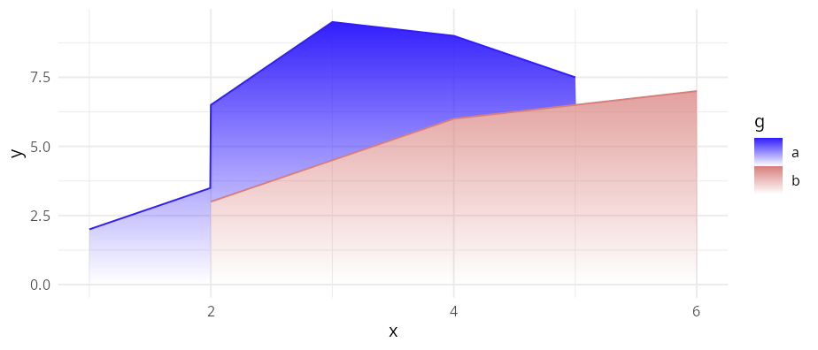

When groups have very different amplitudes or you may not use the
default `position = "stack"` but `stat = "identity"` instead, this can
make smaller groups nearly invisible next to dominant groups.

``` r
df_alpha_scope <- data.frame(
  g = c("a", "a", "a", "b", "b", "b"),
  x = c(1, 3, 5, 2, 4, 6),
  y = c(1, 2, 1, 9, 10, 8)
)
p <- ggplot(df_alpha_scope, aes(x, y, fill = g))
p + geom_area_fade(
  alpha_scope = "global", # default
  position = "identity"
)
```

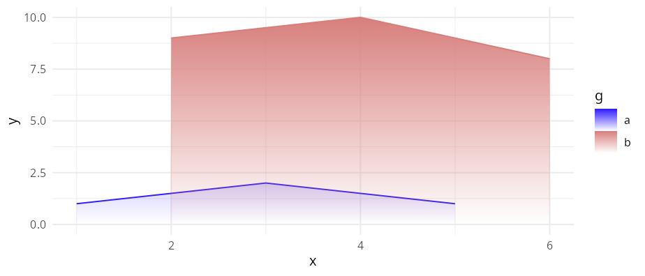

Setting `alpha_scope = "group"` lets the algorithm calculate the alpha
range for each group separately.

``` r
p <- ggplot(df_alpha_scope, aes(x, y, fill = g))

# alpha_scope = "group": each group uses the alpha range independently
p + geom_area_fade(
  alpha_scope = "group", 
  position = "identity"
  )
```

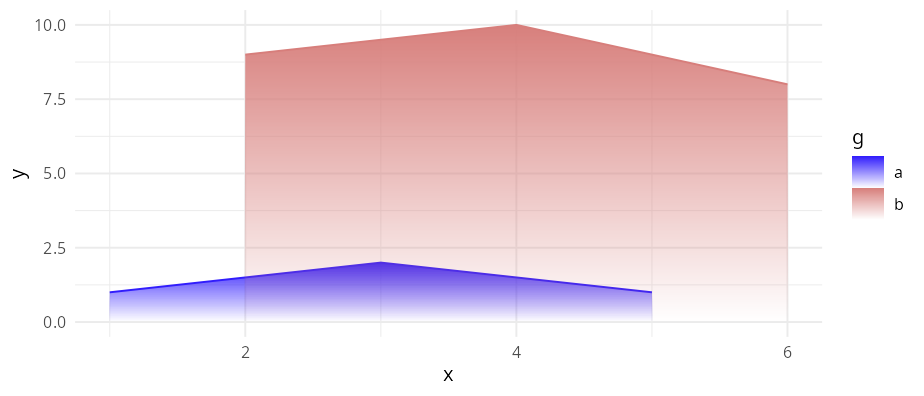

## geom_catenary

`geom_catenary()` draws a flexible curve that simulates a chain or rope
hanging loosely between successive points. By default, the chain length
is twice the Euclidean distance between each `x`/`y` pair. The shape can
be controlled via `chain_length` or `sag`, i.e vertical drop below the
*lowest* endpoint of each segment.

``` r
set.seed(5)
df_catenary <- data.frame(x = 1:4, y = sample(4))
ggplot(df_catenary, aes(x, y)) +
  geom_catenary() +
  geom_point(size = 3)
```

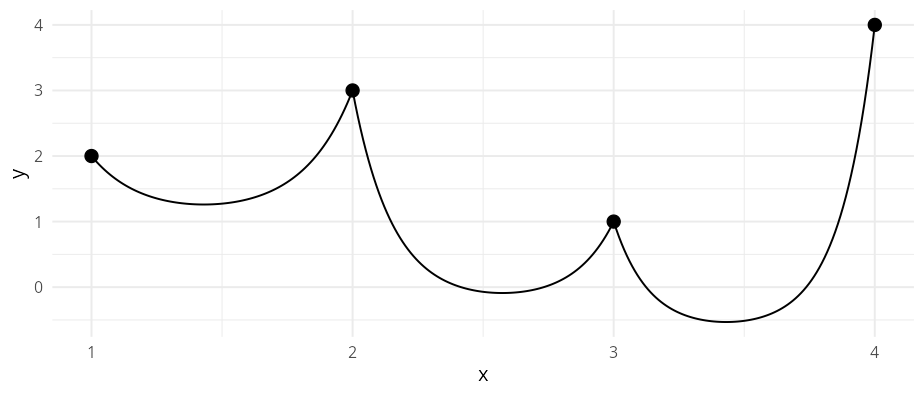

The `sag` argument can be used to define each segment’s drop based on
the smallest value of each segment. `NA` keeps the default. If you
provide `sag` and `chain_length` for the same segment, then `sag` wins.

``` r
ggplot(df_catenary, aes(x, y)) +
  geom_catenary(
    sag = c(2, .5, NA),
    chain_length = c(NA, 4, 6)) +
  geom_point(size = 3)
#> Both `sag` and `chain_length` supplied for 1 segment; using `sag`.
#> This message is displayed once every 8 hours.
```

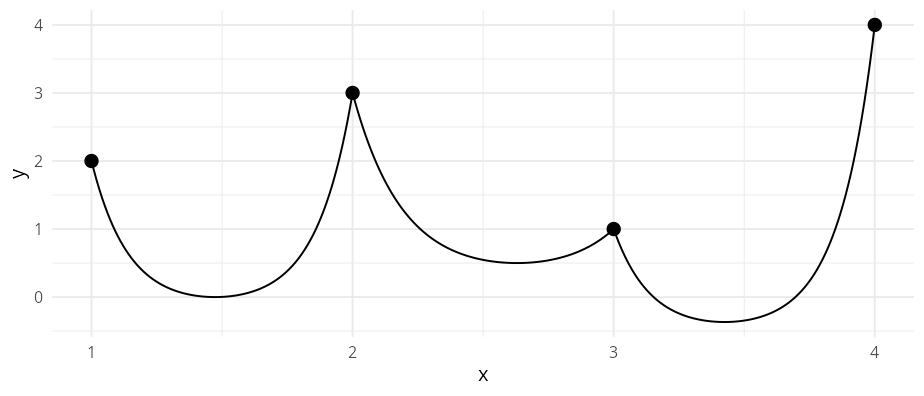

## geom_chaikin

`geom_chaikin()` applies Chaikin’s corner cutting algorithm to turn a
ragged path or polygon into a smooth one. The `closed` argument controls
whether the path is treated as a closed polygon, or an open path.

``` r
lst <- list(
  data = list(
    whale = data.frame(x = c(.5, 4, 4, 3.5, 2), y = c(.5, 1, 1.5, .5, 3)),
    closed_square = data.frame(x = c(0, 0, 1, 1), y = c(2, 3, 3, 2)),
    open_triangle = data.frame(x = c(3, 3, 5), y = c(2, 3, 3)),
    closed_triangle = data.frame(x = c(3.5, 5, 5), y = c(0, 0, 1.5))
  ),
  color = cols,
  mode = c("closed", "closed", "open", "closed")
)

ggplot(mapping = aes(x, y)) +
  lapply(lst$data, \(i) {
    geom_polygon(data = i, fill = NA, linetype = "12", color = "#333333")
  }) +
  Map(f = \(data, color, mode) {
    geom_chaikin(data = data, color = color, mode = mode)
  }, data = lst$data, color = lst$color, mode = lst$mode) +
  geom_point(data = data.frame(x = 1.5, y = 1.5)) +
  coord_equal()
```

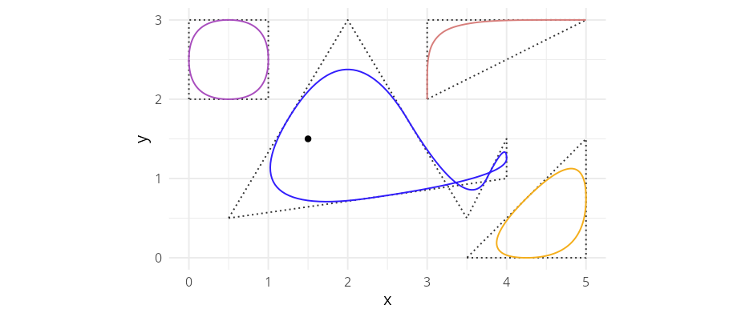

## geom_fourier

`geom_fourier()` fits a Fourier series (via
[fft()](https://search.r-project.org/R/refmans/stats/html/fft.html)) to
the supplied `x`/`y` observations and renders the reconstructed smooth
curve. By default all harmonics up to the Nyquist limit are used, giving
an exact interpolating fit; reducing `n_harmonics` progressively smooths
the result.

The animation below shows how `geom_fourier()` approximates a square
wave as the number of harmonics grows from `n = 1` to the Nyquist limit:


The source script that generates the animation is at
`inst/scripts/gen_fourier_gif.R`.

An optional `detrend` argument removes slow non-periodic trends before
the transform; `detrend` accepts one of `"lm"` or `"loess"`.

``` r
set.seed(1)
x_d <- seq(0, 4 * pi, length.out = 100)
df_d <- data.frame(
  x = x_d,
  y = sin(x_d) + x_d * 0.4 + rnorm(100, sd = 0.2)
)

ggplot(df_d, aes(x, y)) +
  geom_point(alpha = 0.35) +
  geom_fourier(
    aes(colour = "detrend = NULL"),
    n_harmonics = 3
  ) +
  geom_fourier(
    aes(colour = "detrend = \"lm\""),
    n_harmonics = 3,
    detrend = "lm"
  )
```

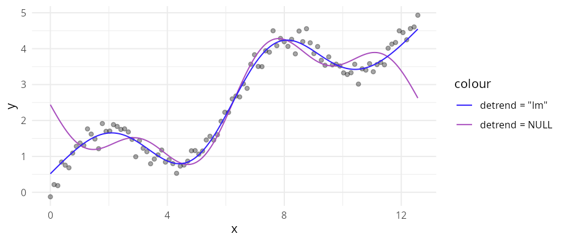

## geom_lexis

`geom_lexis()` is a combination of a segment and a point layer. Given a
start value and an end value, it draws a 45° line indicating the
duration of an event. Required aesthetics are `x` and `xend`; `y` and
`yend` are calculated automatically.

``` r
df2 <- data.frame(
  key = c("A", "B", "B", "C", "D"),
  x = c(0, 1, 6, 5, 6),
  xend = c(5, 4, 10, 8, 10)
)

ggplot(df2, aes(x = x, xend = xend, color = key)) +
  geom_lexis(aes(linetype = after_stat(type)), size = 2) +
  coord_equal() +
  scale_x_continuous(breaks = c(df2$x, df2$xend)) +
  scale_linetype_identity() +
  theme(panel.grid.minor = element_blank())
```

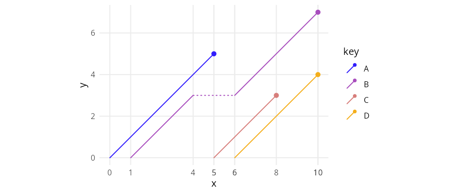

See also the [`LexisPlotR`
package](https://github.com/ottlngr/LexisPlotR).

## geom_point_glow

`geom_point_glow()` is a drop-in replacement for
[`geom_point()`](https://ggplot2.tidyverse.org/reference/geom_point.html)
that adds a radial gradient glow behind each point using
[`grid::radialGradient()`](https://search.r-project.org/R/refmans/grid/html/patterns.html).
The glow colour, transparency (`glow_alpha`), and radius (`glow_size`)
can be set independently of the point itself; by default the glow
inherits the point colour and size.

``` r
ggplot(mtcars, aes(wt, mpg, colour = factor(cyl))) +
  geom_point_glow(glow_size = 5, glow_alpha = .5) +
  coord_cartesian(clip = "off")
```

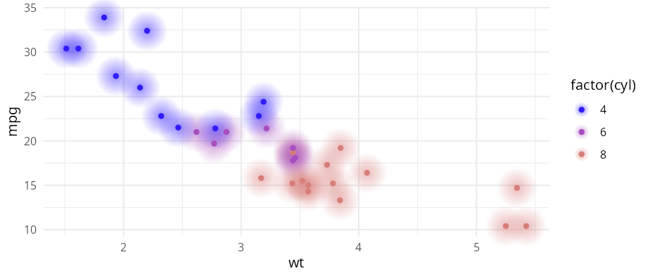

## geom_pointless

`geom_pointless()` lets you highlight observations, by default using a
point layer. Hence it behaves like `geom_point()` but accepts a
`location` argument: `"first"`, `"last"` (default), `"minimum"`,
`"maximum"`, or `"all"` (shorthand for all four).

``` r
x <- seq(-pi, pi, length.out = 500)
y <- outer(x, 1:5, \(x, y) sin(x * y))

df1 <- data.frame(
  var1 = x,
  var2 = rowSums(y)
)

ggplot(df1, aes(x = var1, y = var2)) +
  geom_line() +
  geom_pointless(aes(color = after_stat(location)),
    location = "all",
    size = 3
  )
```

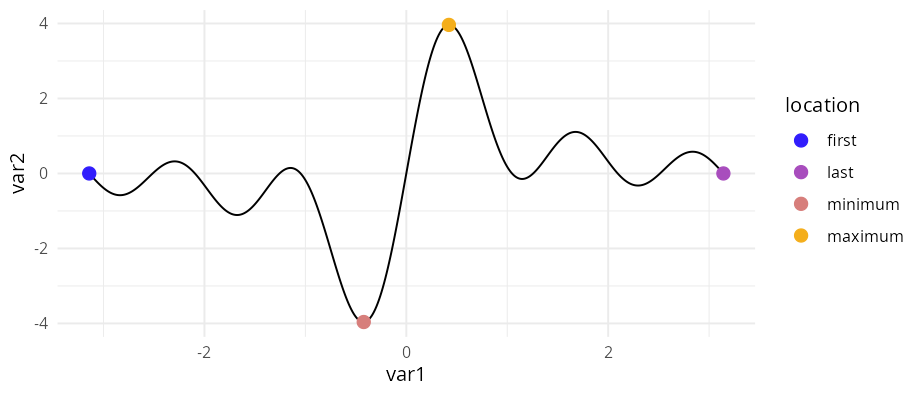

## Code of Conduct

Please note that this project is released with a [Contributor Code of
Conduct](https://github.com/flrd/ggpointless/blob/main/CODE_OF_CONDUCT.md).
By participating in this project you agree to abide by its terms.
